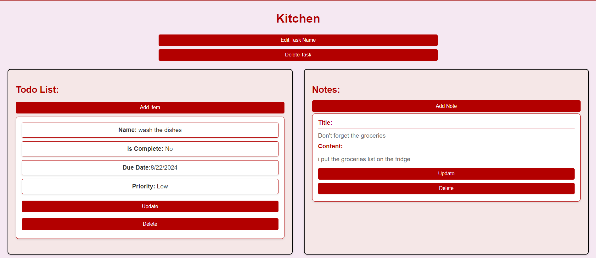

# Personal planner 

## Description 
This is a personal planning react website that orginizes your Daily tasks. You need to login and make an account so you can use the application. inside of each task you can add items and notes those items and notes can be updated or deleted.

## Deployed website 
[Start here!](https://personal-planner-react-frontend.vercel.app/)

## Attributions
### [Chatgpt](https://chatgpt.com/) "used for half of the css"
## Technolgies used 
- React 
- Css
- git hub
- heroku
- vercel  

## User stories
 
- As a guest, I want to be able to sign up, sign in.
- AAU, I want to be able to see my own collection.
- AAU, I want to be able to choose my task.
- AAU, I want to be able to create a new task.
- AAU, I want to be able to delete a task.
- AAU, I want to be able to add notes to each task.
- AAU, I want to be able to edit a note.
- AAU, I want to be able to delete a note.
- AAU, I want to be able to add new list items to each task.
- AAU, I want to be able to edit list items.
- AAU, I want to be able to delete list items.
- AAU, I want to be able to set priority and due date for each list item in a task.
- AAU, I want to be able to edit a task.

 ## Improvments 
 - Adding a calender feature 

- Make it look nicer and more reactive 

- Add a notification system 
 